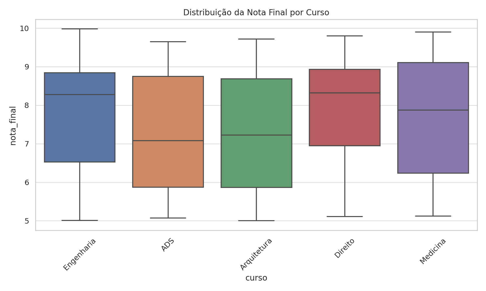
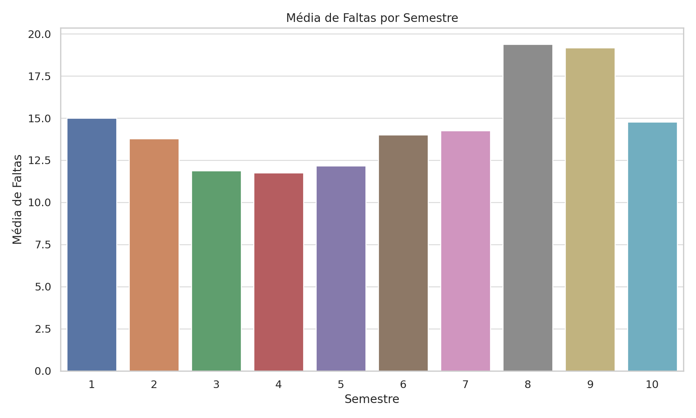
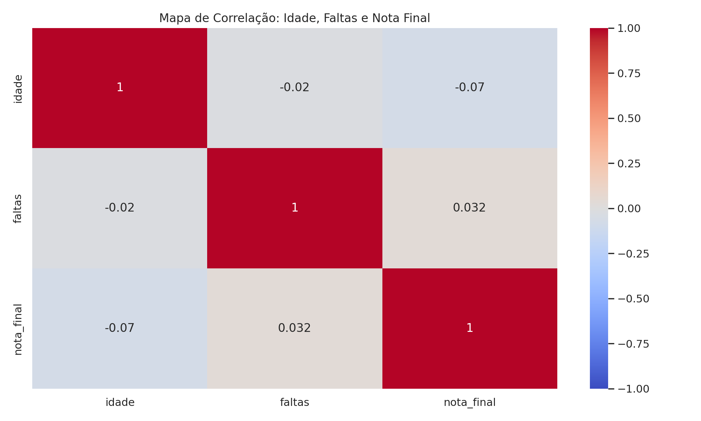
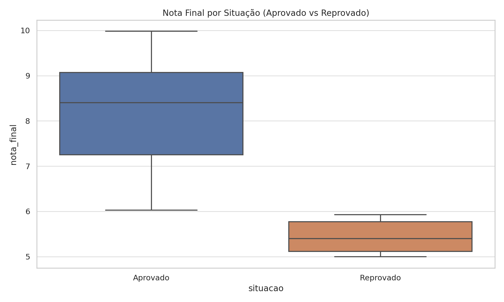
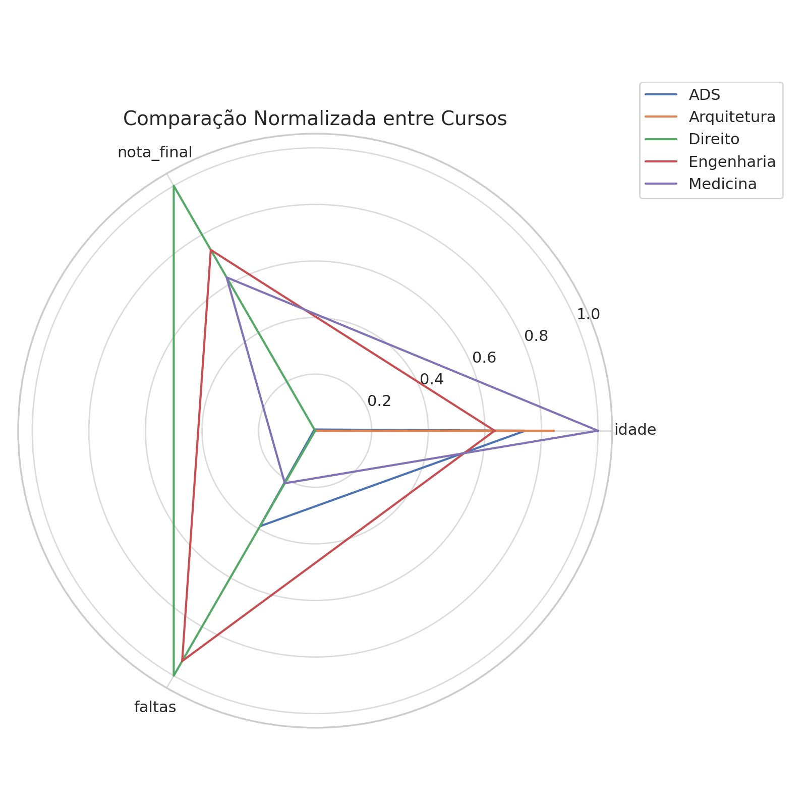
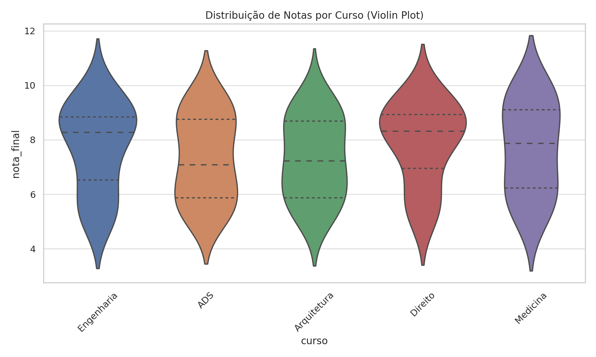
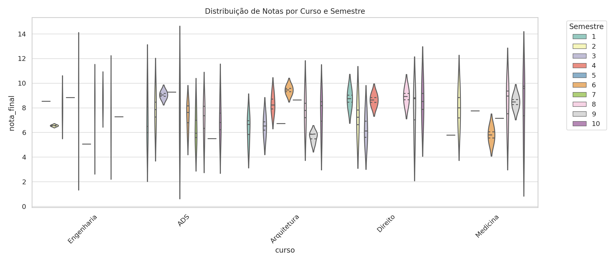
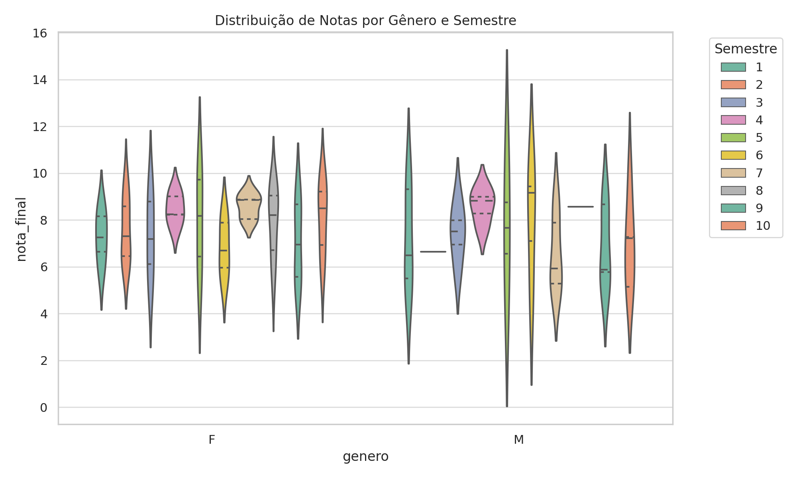
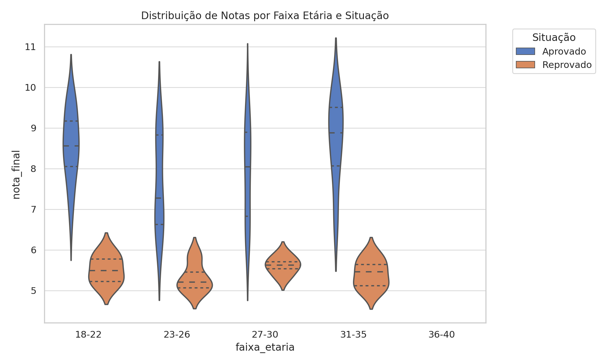
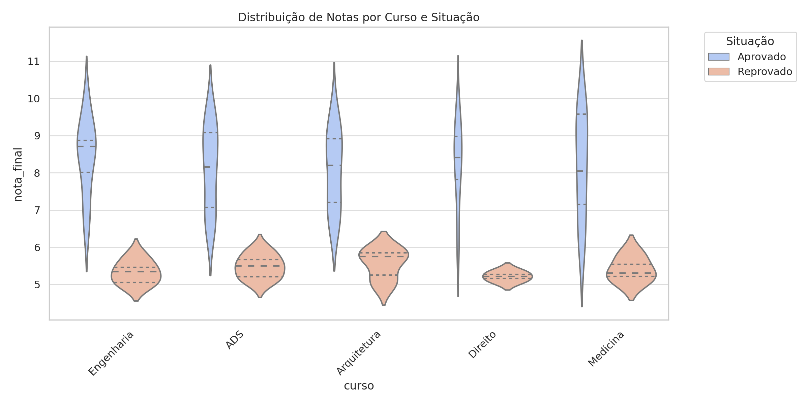

# 📊 Relatório de Análise Exploratória dos Alunos

Este relatório apresenta as principais descobertas da análise exploratória realizada com um conjunto de 100 alunos contendo informações como idade, curso, semestre, nota final, faltas e gênero.

## 📌 Informações Gerais
- Total de alunos analisados: **100**
- Cursos incluídos: ADS, Arquitetura, Direito, Engenharia, Medicina
- Gêneros representados: Masculino (M) e Feminino (F)
- Nota de corte utilizada para aprovação: **6.0**

## 📈 Estatísticas Relevantes
- **Curso com maior média de nota:** Direito (7.87)
- **Curso com maior média de faltas:** Direito (16.18)
- **Gênero com maior média de faltas:** Feminino (15.27 faltas)
- **Semestres com mais faltas:** 8º e 9º semestres (>19 faltas)
- **Faixa etária predominante:** 23 a 30 anos
- **Correlação entre faltas e nota:** Negativa, como esperado (mais faltas → tendência a nota mais baixa)

## 📊 Gráficos e Visualizações
### Boxplot Nota por Curso

### Faltas por Semestre

### Faltas vs Nota Final (Dispersão)

### Mapa de Correlação

### Nota por Situação

### Radar de Cursos

### Violin por Curso

### Violin por Gênero

### Violin Curso x Semestre

### Violin Gênero x Semestre

### Violin Faixa Etária x Situação

### Violin Curso x Situação

## 🔍 Insights Importantes
- Apesar de alunos reprovados terem notas baixas, a média de faltas entre eles foi **menor** que entre os aprovados.
- A distribuição das notas por curso e por gênero não apresenta grandes distorções, indicando equilíbrio de desempenho.
- A análise por faixa etária mostra que alunos entre 23 e 30 anos concentram maior parte das reprovações.
- Os gráficos de violino e radar ajudaram a visualizar claramente a densidade, variações e padrões por grupo.

---
### Feito por Caio Harrys