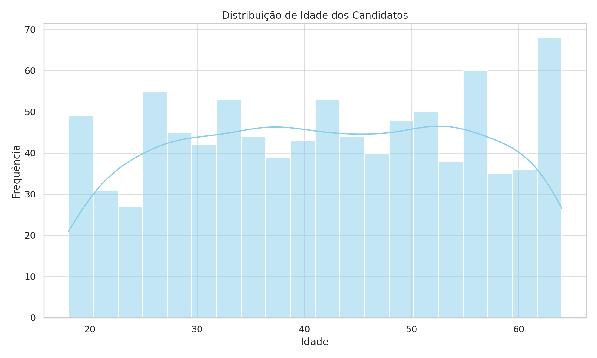
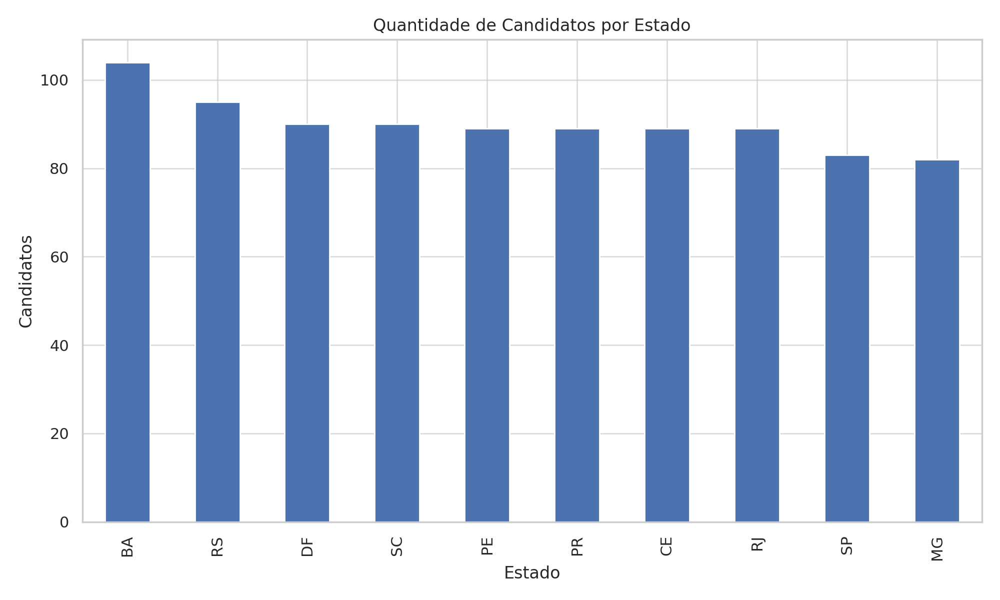
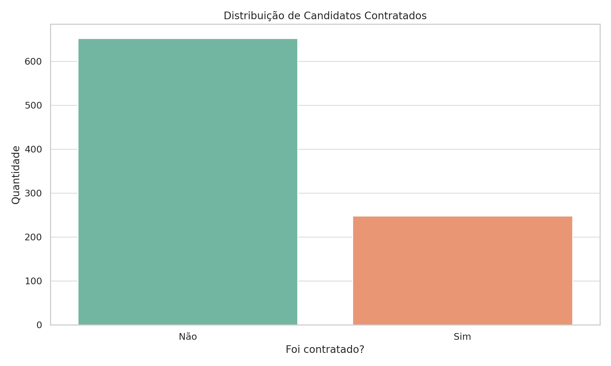
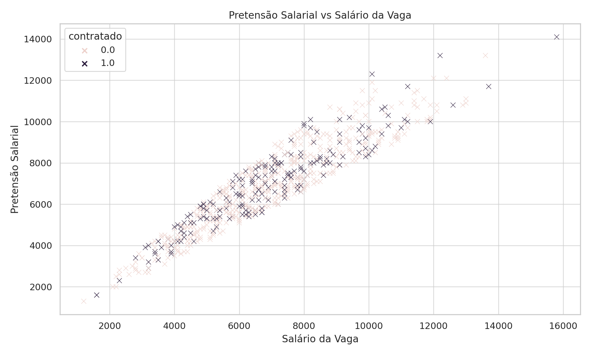
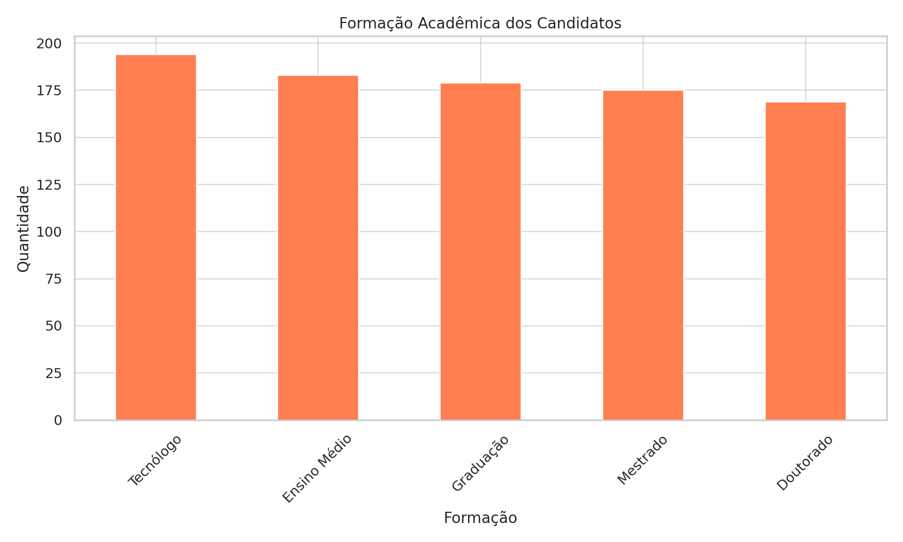

#  Relatório de Análise de Candidatos da Área de Tecnologia

### Este relatório resume as informações obtidas a partir de uma análise exploratória de 1.000 candidatos da área de tecnologia.

##  Visão Geral

- Total de candidatos analisados: **1000**
- Média de idade: **41.7 anos**
- Percentual de contratados: **27.6%**
- Percentual de candidatos PCD: **4.5%**

##  Perfil dos Candidatos

- Formação mais comum: **Tecnólogo**
- Área de atuação mais frequente: **Tecnologia**
- Idioma estrangeiro mais comum: **Nenhum**
- Estado com maior número de candidatos: **BA**

##  Insights Interessantes

- A maioria dos candidatos **não possui idioma estrangeiro declarado**, o que pode ser um ponto de atenção para vagas que exigem comunicação internacional.
- **A Bahia (BA)** é o estado com mais candidatos, revelando uma forte concentração regional.
- Apesar da alta qualificação, **apenas 27,5% foram contratados**, o que sugere um funil de seleção bastante competitivo.
- Apenas **4,5% dos candidatos se declararam PCD**, indicando baixa representatividade nesse grupo.

---

## Visualizações Gráficas

### Distribuição da Idade dos Candidatos

### Quantidade de Candidatos por Estado

### Distribuição de Candidatos Contratados

### Pretensão Salarial vs Salário da Vaga

### Formação Acadêmica dos Candidatos

---
### **Feito por Caio Harrys**