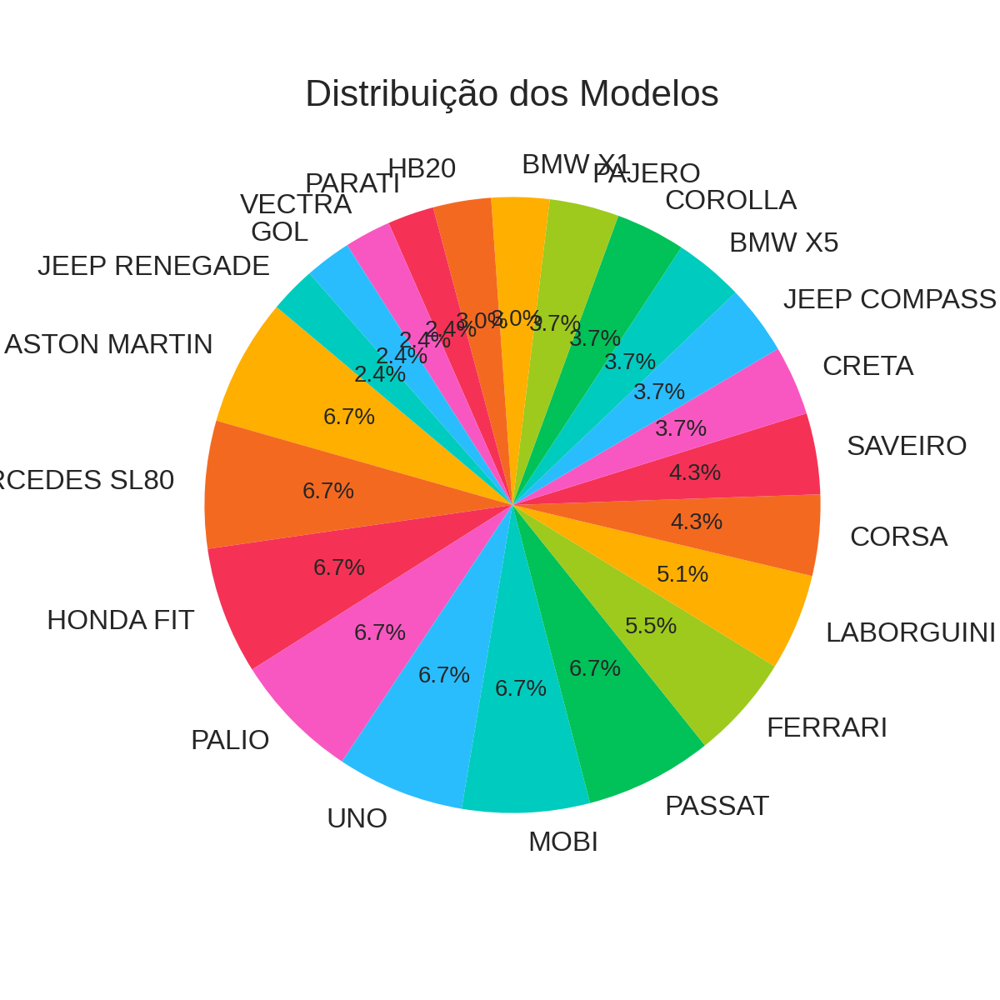
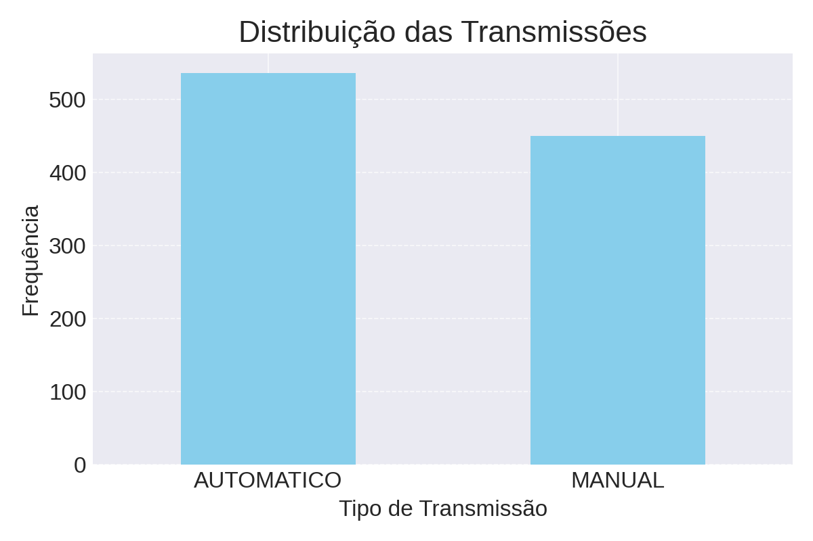
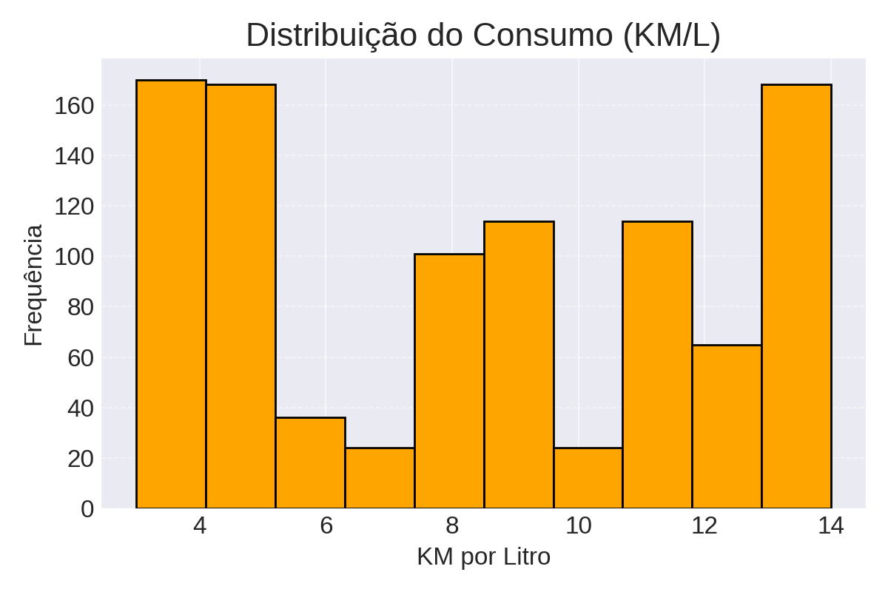
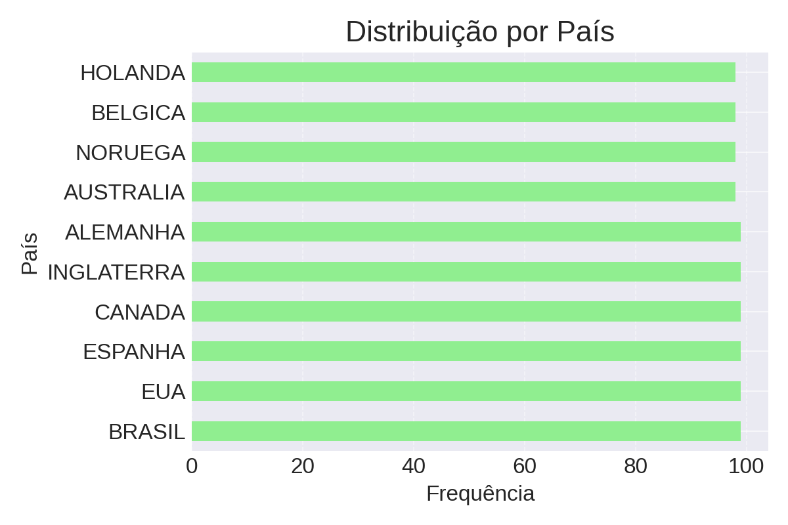

#  Relatório de Codificação de Variáveis Categóricas e Análise Exploratória

Este relatório resume as principais etapas de tratamento e análise do dataset de veículos de luxo, contendo informações como modelo, país, potência, consumo e tipo de transmissão.

---

##  Etapas Realizadas

1. **Identificação de colunas categóricas**: `MODELO`, `PAIS`, `TRANSMISSAO`
2. **Codificação com `get_dummies()`**: Inclusão de colunas binárias para representar categorias.
3. **Uso de `OneHotEncoder` com `sklearn`**: Abordagem alternativa mais flexível para machine learning.
4. **Pipeline com `ColumnTransformer`**: Padronização de colunas numéricas e codificação em conjunto.
5. **Modelo de Árvore de Decisão**: Previsão da variável `KM-LITRO` com base nas demais características.
6. **Criação de gráficos para análise exploratória**.

---

##  Gráficos Gerados

### 1. Distribuição dos Modelos


### 2. Distribuição das Transmissões



### 3. Distribuição de KM/L


### 4. Frequência por País


---

## Métricas do Modelo

- Foi treinado um modelo de **Árvore de Decisão** com profundidade máxima de 3 para prever o consumo (`KM-LITRO`).  
- O erro quadrático médio (MSE) obtido foi:

```
MSE: 0.479
```

---

##  Conclusões

- O modelo mais comum no dataset é o **LABORGUINI**, seguido por Ferrari e Aston Martin.
- A transmissão **AUTOMÁTICA** é predominante.
- A distribuição de `KM-LITRO` é relativamente centrada, com poucas variações.
- Países de origem dos veículos estão bem distribuídos, com destaque para **Brasil e EUA**.
- O modelo de árvore de decisão teve erro baixo, indicando boa capacidade de predição com as variáveis codificadas.

---

 Portanto conseguimos evidenciar como a codificação de variáveis categóricas e a visualização dos dados são fundamentais para entender um conjunto de dados e construir modelos de machine learning robustos.

---

## Feito por Caio Harrys