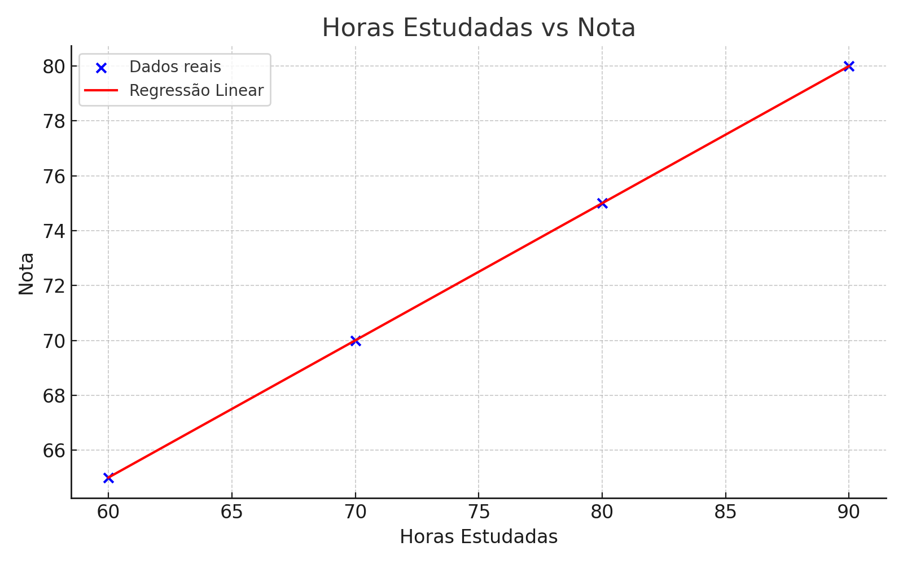

# Regressão Linear em Machine Learning e IA

A **regressão linear** é uma das técnicas mais simples e fundamentais em **Machine Learning (ML)** e **Inteligência Artificial (IA)**. Ela serve para **prever um valor numérico contínuo** com base em uma ou mais variáveis de entrada.

---

## 🎯 Para que serve a regressão linear:

### ✅ 1. Previsão de valores
Ela é usada para **prever** um resultado com base em dados históricos. Exemplos:
- Prever o preço de uma casa com base em seu tamanho.
- Prever vendas futuras com base em dados passados.
- Prever temperatura, lucros, salários, etc.

### ✅ 2. Identificar relações entre variáveis
Ela mostra **como uma variável afeta outra**. Exemplo:
- Como a quantidade de horas estudadas afeta a nota de um aluno.
- Como o número de anúncios impacta o número de vendas.

### ✅ 3. Modelo base para problemas mais complexos
É usada como **modelo de base (baseline)** para comparar com modelos mais sofisticados (como árvores de decisão, redes neurais, etc).

---

## 🔍 Como funciona (simples):

A regressão linear aprende uma equação do tipo:

```
y = a * x + b
```

- `y`: valor que você quer prever (ex: preço).
- `x`: entrada (ex: área da casa).
- `a`: coeficiente (quanto `x` influencia `y`).
- `b`: intercepto (valor base).

---

## 💡 Exemplo em Python (usando scikit-learn):

```python
from sklearn.linear_model import LinearRegression
import numpy as np

# Dados de exemplo
X = np.array([[60], [70], [80], [90]])  # horas estudadas
y = np.array([65, 70, 75, 80])          # notas

# Criar e treinar o modelo
model = LinearRegression()
model.fit(X, y)

# Prever a nota para 85 horas de estudo
nota_prevista = model.predict([[85]])
print(nota_prevista)
```

---

## 📊 Gráfico: Regressão Linear



O gráfico acima mostra a relação entre **horas estudadas** e **nota obtida**, com a linha de regressão aprendida pelo modelo.

---

